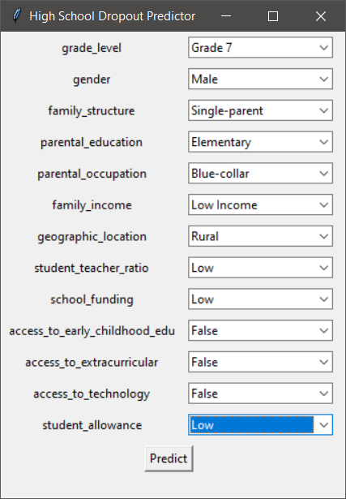
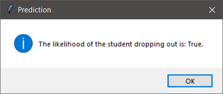

# High School Dropout Prediction Model

  

  

Authors: [Jerome Bercero](https://www.linkedin.com/in/jerome-esguerra-bercero/) · [Ryan Caabay](https://www.linkedin.com/in/ryancaabay/) · [Ezekiel Morales](https://www.linkedin.com/in/ezekiel-morales-b06383266/)

This is a code implementation of a machine learning model that predicts high school dropout rates by correlating it to student demographics and socioeconomic data. By identifying the most significant factors that contribute to high school dropout rates, it can provide insights and predictions that can eventually alert school administrators and parents of students to intervene and prevent dropout in the Philippines. The project involves collecting and processing data on demographic and socioeconomic status such as income, age, gender, location, and educational performance. These collected data will then be compiled into a dataset that will be used into training machine learning models. The model can then be used to make predictions on new data, allowing educators to identify students that are prone to dropout and suggest possible interventions.

